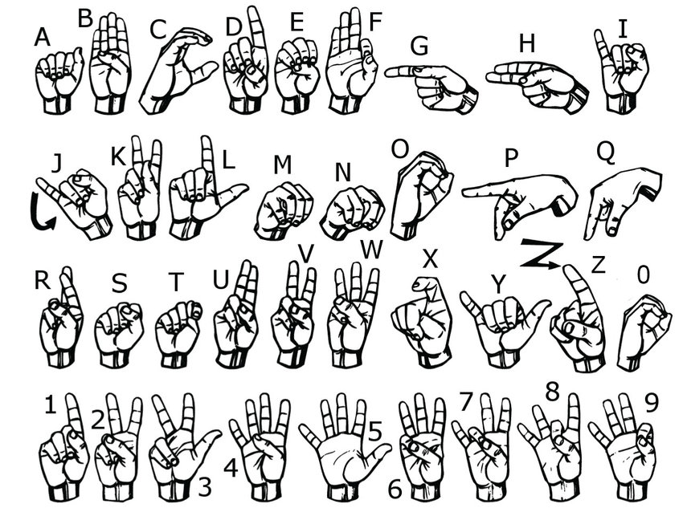
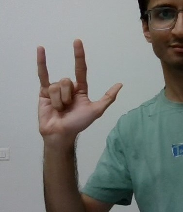
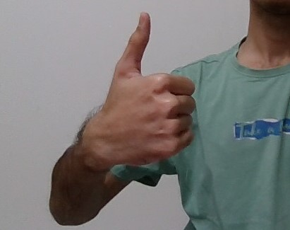

# 🤟 Sign Language to Text and Speech Conversion

## 📌 Overview

This project, **Sign Language to Text and Speech Conversion using Machine Learning**, is a real-time computer vision application that recognizes American Sign Language (ASL) hand gestures and converts them into text and speech.

The system is designed to help bridge the communication gap between people who use sign language and those who may not understand it.

---

## 🎯 Features

- **Real-Time Recognition**: Recognizes hand gestures through a live webcam feed.
- **Gesture Classification**: Uses a Random Forest machine learning model to classify hand gestures.
- **Alphabet and Digit Recognition**: Supports A-Z alphabets and 0-9 digits.
- **Word and Sentence Formation**: Uses SPACE and FULL STOP gestures to construct words and sentences.
- **Text-to-Speech Conversion**: Converts recognized text into audible speech.
- **User-Friendly GUI**: Displays recognized characters and generated text in real time.
- **Pre-Trained Model**: Includes a trained model that can be used directly.
- **Custom Training**: Provides scripts for collecting data and training a new model.

---
## 📊 Project Highlights

### Custom Dataset Creation

We created a custom dataset of ASL gestures covering A-Z alphabets, 0-9 digits, SPACE, and FULL STOP.

**The 26 letters and 10 digits of American Sign Language (ASL)**

**Sign for J**

**Sign for Z**

**Sign for SPACE**

**Sign for FULL STOP**

## 🔧 Technology Stack

### Programming Language

- Python

### Libraries

- OpenCV
- MediaPipe
- NumPy
- Tkinter
- Pyttsx3
- Scikit-learn

### Machine Learning Model

- Random Forest Classifier

---

## 🧠 How the Project Works

Webcam
   ↓
Capture Hand Gesture
   ↓
MediaPipe Hand Detection
   ↓
Extract 21 Hand Landmarks
   ↓
Generate 42 Features
   ↓
Random Forest Classifier
   ↓
Recognized Character
   ↓
Text Formation
   ↓
Text-to-Speech
   ↓
Spoken Output

## 👨‍💻 My Contribution

- Contributed to the development of the sign language recognition system.
- Worked on collecting and preparing the hand gesture dataset.
- Contributed to hand landmark feature extraction using MediaPipe.
- Assisted in training and testing the Random Forest classifier.
- Worked with the real-time webcam-based gesture recognition process.
- Contributed to integrating the recognized gestures with text and speech output.
- Participated in testing and debugging the application.

---

## 📚 Learning Outcomes

Through this project, I gained practical experience in:

- Python programming
- Computer Vision using OpenCV
- Hand landmark detection using MediaPipe
- Machine Learning using Random Forest
- Dataset collection and preprocessing
- Feature extraction
- Real-time webcam processing
- Text-to-Speech using Pyttsx3
- GUI development using Tkinter
- Model training and testing
- Git and GitHub for version control

---

## 🚀 Future Enhancements

- Support for dynamic sign-language gestures
- Recognition of complete words
- Support for additional sign languages
- Mobile and web application deployment
- Improved recognition accuracy using deep learning
- Multi-hand gesture recognition

---

## 📝 License

This project is licensed under the MIT License. See the `LICENSE` file for details.
